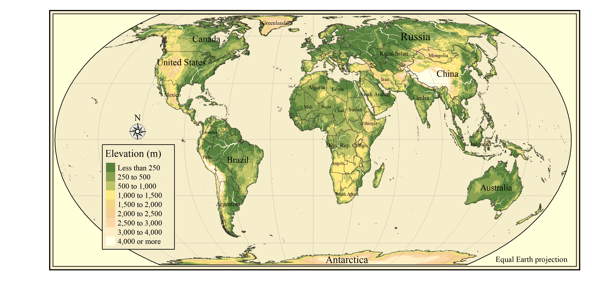
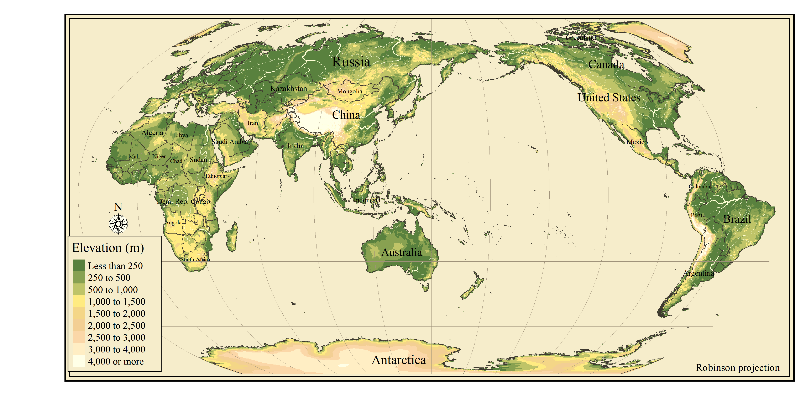

#  `R`语言绘制精美世界地图


## 以大西洋为中心的世界地图

```R
library(sf)
library(tmap)
library(terra)
library(tidyverse)

data("land", "rivers", package = "tmap")
sf_use_s2(FALSE)

# 绘制以大西洋为中心世界地图
rivers |> 
  st_transform(8857) -> rivers
world = read_sf('./data/world.gdb',layer='大西洋中心世界矢量') |> 
  st_transform(8857)
cn = read_sf('./data/china.gdb',layer='边界线') |> 
  st_geometry()

land |> 
  rast() %>% 
  .[[4]] -> elev

names(elev) = 'elevation'
plot(elev)
elev |> 
  project(crs('epsg:8857')) |> 
  plot()

elev |> 
  project(crs('epsg:8857'))-> elev

tm_shape(elev)+
  tm_raster(breaks = c(-Inf, 250, 500, 1000, 1500, 2000, 2500, 3000, 4000, Inf),  
            palette = terrain.colors(9), title = "Elevation (m)") +
  tm_shape(rivers) + 
  tm_lines("lightblue", lwd = "strokelwd", scale = 1.5, legend.lwd.show = FALSE) +
  tm_shape(world,is.master = TRUE) +
  tm_borders("grey20", lwd = .5) +
  tm_text("name", size = "area",legend.size.show=FALSE,legend.col.show=FALSE) +
  tm_shape(cn) + 
  tm_lines("grey20", lwd = .9) +
  tm_graticules(labels.size = 0.4, lwd = 0.25,labels.show =FALSE) +
  tm_compass(size=1.6,position = c(0.14,0.5)) +
  tm_credits("Equal Earth projection", position = c("RIGHT", "BOTTOM")) +
  tm_style("classic",
           bg.color = "lightblue",
           space.color = "grey90",
           frame.doule.line = FALSE,
           earth.boundary = TRUE) + 
  tm_legend(position = c(0.1,0.08),
            frame =TRUE) -> world_elev_map

tmap_save(world_elev_map, "world_elev_map.png",
          width = 6.125, scale = .7, dpi = 600)
```



## 以太平洋为中心的世界地图

```R
# 处理世界地图矢量
world = read_sf('./data/world.gdb',layer='大西洋中心世界矢量')

'PROJCS["World_Robinson",
    GEOGCS["WGS 84",
        DATUM["WGS_1984",
            SPHEROID["WGS 84",6378137,298.257223563,
                AUTHORITY["EPSG","7030"]],
            AUTHORITY["EPSG","6326"]],
        PRIMEM["Greenwich",0],
        UNIT["Degree",0.0174532925199433]],
    PROJECTION["Robinson"],
    PARAMETER["longitude_of_center",150],
    PARAMETER["false_easting",0],
    PARAMETER["false_northing",0],
    UNIT["metre",1,
        AUTHORITY["EPSG","9001"]],
    AXIS["Easting",EAST],
    AXIS["Northing",NORTH],
    AUTHORITY["ESRI","54030"]]' -> targetCrs

world |> 
  st_transform(st_crs(targetCrs)) |> 
  st_geometry() |> 
  plot()

c(-0.0001 - 30, 90, 0 - 30, 90, 0 - 30, -90,
  -0.0001 - 30, -90, -0.0001 - 30, 90) |> 
  matrix(ncol = 2, byrow = TRUE) |> 
  list() |> 
  st_polygon() |> 
  st_sfc(crs = 4326) %>% 
  st_sf(geometry = .) -> polygon

world |> 
  st_difference(polygon) |> 
  st_transform(st_crs(targetCrs)) |> 
  st_cast('MULTIPOLYGON')-> world2
plot(world2['name'])
write_sf(world2,'./data/world.gdb',layer='太平洋中心世界矢量',overwrite=TRUE)

# 绘制以太平洋为中心的世界地图
data("land", "rivers", package = "tmap")

world = read_sf('./data/world.gdb',layer='太平洋中心世界矢量')
rivers |> 
  st_transform(st_crs(targetCrs)) -> rivers
cn = read_sf('./data/china.gdb',layer='边界线') |> 
  st_transform(st_crs(targetCrs)) |> 
  st_geometry()

land |> 
  rast() %>% 
  .[[4]] -> elev

names(elev) = 'elevation'
plot(elev)
elev |> 
  project(crs(vect(world))) |> 
  plot()

elev |> 
  project(crs(vect(world)))-> elev

tm_shape(elev)+
  tm_raster(breaks = c(-Inf, 250, 500, 1000, 1500, 2000, 2500, 3000, 4000, Inf),  
            palette = terrain.colors(9), title = "Elevation (m)") +
  tm_shape(rivers) + 
  tm_lines("lightblue", lwd = "strokelwd", scale = 1.5, legend.lwd.show = FALSE) +
  tm_shape(world,is.master = TRUE) +
  tm_borders("grey20", lwd = .5) +
  tm_text("name", size = "area",legend.size.show=FALSE,legend.col.show=FALSE) +
  tm_shape(cn) + 
  tm_lines("grey20", lwd = .9) +
  tm_graticules(labels.size = 0.4, lwd = 0.25,labels.show =FALSE) +
  tm_compass(size=1.5,position = c(0.05,0.4)) +
  tm_credits("Robinson projection", position = c("RIGHT", "BOTTOM")) +
  tm_style("classic",
           bg.color = "lightblue",
           space.color = "grey90",
           frame.doule.line = FALSE,
           earth.boundary = TRUE) + 
  tm_legend(position = c(0.005,0.027),
            frame =TRUE) -> world_elev_map2

tmap_save(world_elev_map2, "world_elev_map2.png", width = 6.5, scale = .7, dpi = 600)
```



## 项目数据集介绍

### `china.gdb`：


>  边界线图层为中国陆上国界线和南海九段线
>
>  省图层为中国省级行政区划
>
>  市图层为中国市级行政区划
>
>  县图层为中国县级行政区划

### `world.gdb`：


> 大西洋中心世界矢量图层是以大西洋为中心的世界国家行政边界（中国部分国界线已处理）
>
> 太平洋中心世界矢量图层是以太平洋为中心的世界国家行政边界（中国部分国界线已处理）
>
> 海洋图层是世界几个大洋的矢量面
>
> 湖泊图层是世界主要湖泊的矢量面
>
> 海岸线图层是世界海岸线的矢量线
>
> 陆地图层是世界大洲的矢量面，大洲图层亦是
>
> 河流图层是世界主要河流的矢量线

## [作者知乎博客](https://www.zhihu.com/people/lyu-geosocial)

